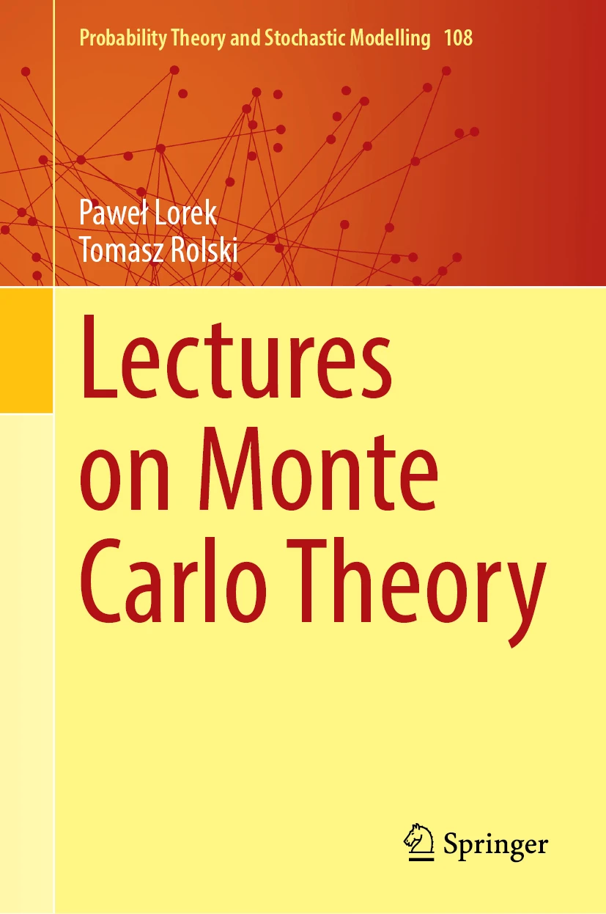

# Lectures on Monte Carlo Theory

<table>
<tr>
<td>

</td>
<td>

| Book title&nbsp;&nbsp;&nbsp;&nbsp; | Lectures on Monte Carlo Theory  &nbsp;&nbsp;&nbsp;&nbsp;&nbsp;&nbsp;&nbsp;&nbsp;&nbsp;&nbsp;&nbsp;&nbsp;&nbsp;&nbsp;&nbsp;&nbsp; |
|------------------------------------|---------------------------------------------------------------------------------------------------------------------------------|
| **Authors**                        | Paweł Lorek and Tomasz Rolski                                                                                                   |
| **Contact** | pawel.lorek [at] math.uni.wroc.pl tomasz.rolski [at] math.uni.wroc.pl                                                            |
| **Affiliation**                    | University of Wrocław, Poland                                                                                                   |
| **Publisher**                      | Springer, 2025                                                                                                                  |
| **Springer link**                  | [link.springer.com/book/9783032011893](https://link.springer.com/book/9783032011893)                                            |
| **Series**                         | *Probability Theory and Stochastic Modelling*                                                                                   |
| **ISBN**                           | 978-3-032-01189-3                                                                                                               |

</td>
</tr>
</table>

This sentence uses `$` delimiters to show math inline: $\sqrt{3x-1}+(1+x)^2$

# Errata for *Lectures on Monte Carlo Theory*

This file records corrections or clarifications found after publication.
Page and figure numbers refer to the printed edition.

---

### 📄 Page 91 — Exercise 2.T.10
**Issue:** Incorrect expression for the $p$-value.

**Printed version:**
$p=Q\left(k/2, 2W(\mathrm{obs})\right)$ .....

**Correct version:**
AA $$p = Q\left(k/2, W(\mathrm{obs})/2\right)$$ BB $p\!=\!Q(k/2,\,W(\mathrm{obs})/2)$ ... CC: $p = Q(k\!/\!2,\; W(\mathrm{obs})\!/\!2)$ k/2 $k$/2

---

### 📄 Page 129 — Figure 3.5 (left)
**Issue:** The labels \( t_1 \) and \( t_2 \) are interchanged.
**Correction:** \( t_1 \) should correspond to the lower angle and \( t_2 \) to the upper one.
*(Applies only to the left panel of Fig. 3.5; the right panel is correct.)*

---

_Last updated: November 2025_

_Last updated: November 2025_

